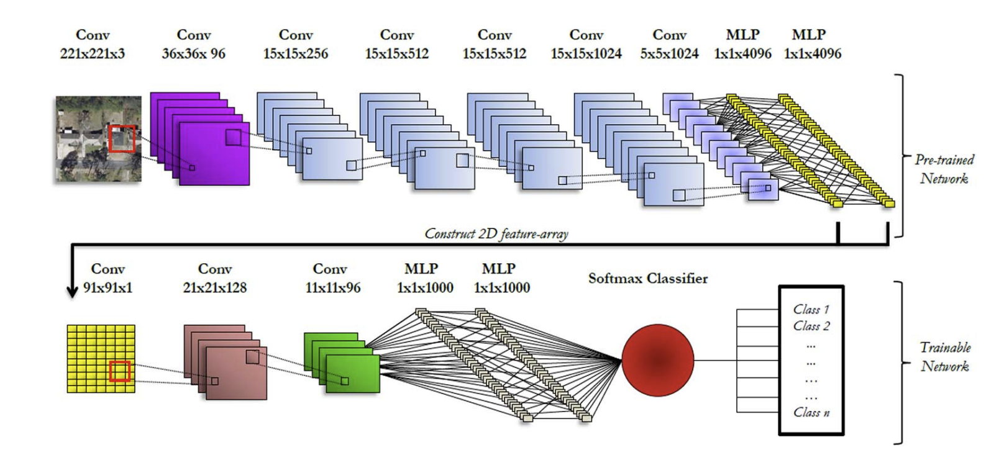

# Deep Learning Remote Sensing Image Classification Using Pretrained Networks
PyTorch implementation of paper [Deep Learning Earth Observation Classification Using ImageNet Pretrained Networks](https://ieeexplore.ieee.org/document/7342907)

## Difference
Due to the lack of Overfeat's PyTorch Pre-trained model, we replace Overfeat with AlexNet which has a very similar structure
## Requirements  
To install requirements  
``
conda env create -f environment.yml
``
## Usage
1. Clone this Repository  
2. Download and Unzip the [UCMerced_LandUse](http://weegee.vision.ucmerced.edu/datasets/landuse.html) dataset  
3. ``python train.py``
## Result
| Metric            | Reported | Our Implementation |
|-------------------|----------|--------------------|
| Test-set accuracy | 92.4%    | 93.57%             |
